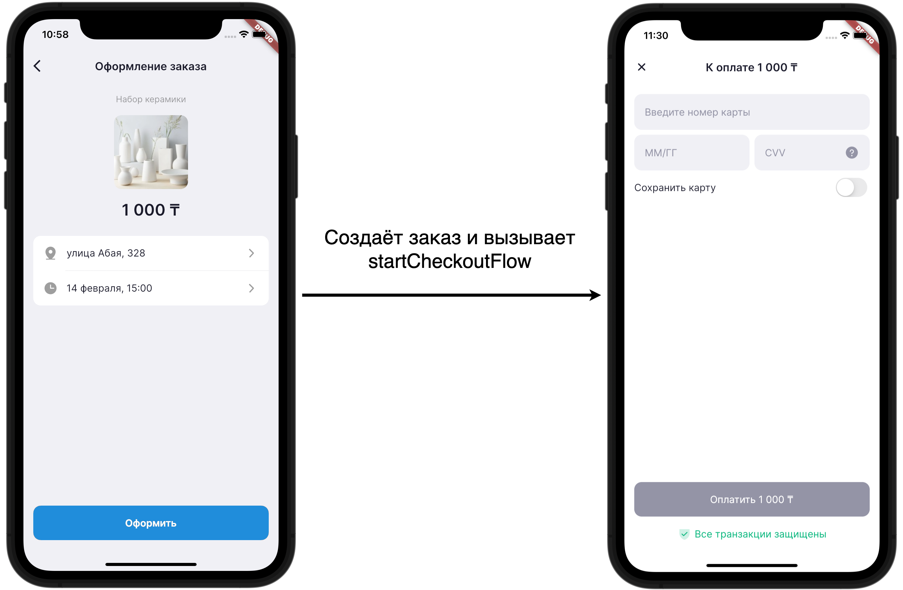
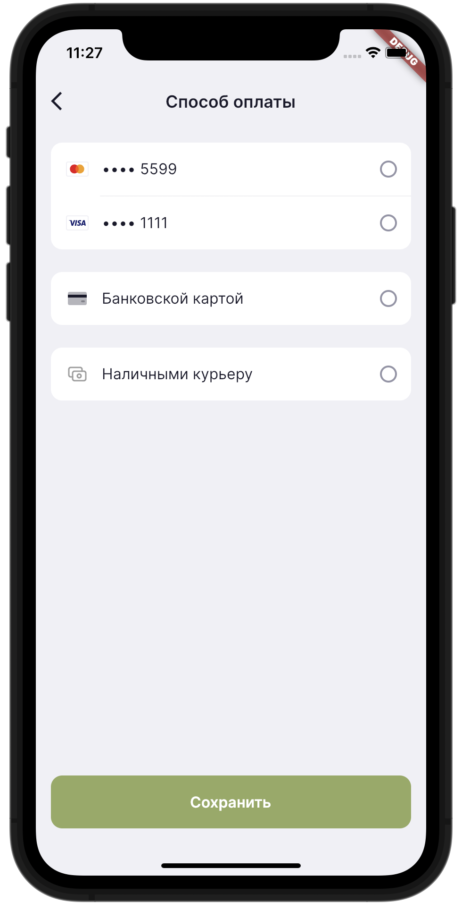

# Инструкция для показа формы оплаты

После [установки SDK](./setup.md) можно начинать принимать оплату.

Для этого используется метод `startCheckoutFlow` или 
`startCheckoutWithSavedCardFlow`.

## Оглавление

- [Оплата заказа новой картой](#оплата-заказа-новой-картой)
  - [1. Отобразить экран оформления заказа](#1-отобразить-экран-оформления-заказа)
  - [2. Вызвать метод своего бэкенда для создания заказа](#2-вызвать-метод-своего-бэкенда-для-создания-заказа)
  - [3. Вызвать метод оплаты в SDK](#3-вызвать-метод-оплаты-в-sdk)
  - [3.1. Сохранение карт](#31-сохранение-карт)
  - [3.2. Обработка результата](#32-обработка-результата)
- [Оплата заказа сохраненной картой](#оплата-заказа-сохраненной-картой)
  - [1. Отобразить экран оформления заказа](#1-отобразить-экран-оформления-заказа-1)
  - [2. Получить сохраненные карты пользователя](#2-получить-сохраненные-карты-пользователя)
  - [3. Отобразить сохраненные карты в своем интерфейсе](#3-отобразить-сохраненные-карты-в-своем-интерфейсе)
  - [4. Вызвать метод своего бэкенда для создания заказа](#4-вызвать-метод-своего-бэкенда-для-создания-заказа)
  - [5. Вызвать метод оплаты в SDK](#5-вызвать-метод-оплаты-в-sdk)
  - [5.1. Метод оплаты сохраненной картой](#51-метод-оплаты-сохраненной-картой)
  - [5.2. Метод оплаты новой картой](#52-метод-оплаты-новой-картой)

## Оплата заказа новой картой

(Подразумевается, что мерчант уже засетапил бэк - или стоит про это писать 
здесь?)

Для оплаты заказа новой картой используется метод `startCheckoutFlow`. Пошаговый
алгоритм таков:

[1. Отобразить экран оформления заказа](#1-отобразить-экран-оформления-заказа)

[2. Вызвать метод своего бэкенда для создания заказа](#2-вызвать-метод-своего-бэкенда-для-создания-заказа)

[3. Вызвать метод оплаты в SDK](#3-вызвать-метод-оплаты-в-sdk)

- [3.1. Сохранение карт](#31-сохранение-карт)

- [3.2. Обработка результата](#32-обработка-результата)

### 1. Отобразить экран оформления заказа

Этот экран предоставляет пользователю возможность проверить заказанные товары
и общую сумму заказа, выбрать время и адрес доставки. В этом экране должна быть 
кнопка "Оплатить", которая непосредственно создаёт сам заказ.

Снизу [пример](/demo/lib/pages/checkout_page.dart) такого экрана в 
демо-приложении SDK.



### 2. Вызвать метод своего бэкенда для создания заказа

При нажатии на кнопку необходимо сначала создать заказ на сервере и получить 
`order_access_token`.

```dart
ElevatedButton(
  onPressed: () async {
    // Создаём заказ при нажатии на кнопку и сохраняем order_access_token
    final orderAccessToken = await MyBackend.createOrder();
  },
  child: const Text('Оформить'),
);
```

### 3. Вызвать метод оплаты в SDK

После создания заказа на сервере необходимо вызвать метод 
`Ioka.instance.startCheckoutFlow()`, передав туда `context` и 
`order_access_token`:

```dart
ElevatedButton(
  onPressed: () async {
    // Создаём заказ при нажатии на кнопку и сохраняем order_access_token
    final orderAccessToken = await MyBackend.createOrder();

    // Начинаем оплату - передаём этот токен и контекст в [startCheckoutFlow]
    await Ioka.instance.startCheckoutFlow(
      context: context,
      orderAccessToken: orderAccessToken,
    );

    // Закрываем страницу оформления заказа
    Navigator.pop(context);
  },
  child: const Text('Оформить'),
);
```

### 3.1. Сохранение карт

Опционально в функцию `startCheckoutFlow` можно передать 
`customer_access_token` - в таком случае у пользователя будет возможность
сохранить (привязать) карту для дальнейших покупок.

### 3.2. Обработка результата

Метод `startCheckoutFlow` возвращает `Future` типа `ExtendedPayment` - 
подробнее об этом классе можно прочитать в документации API.

В случае, если пользователь прервал оплату, то функция возвращает `null`.

Этим можно воспользоваться, например, чтобы очистить корзину при успешном
оформлении заказа:

```dart
ElevatedButton(
  onPressed: () async {
    // Создаём заказ при нажатии на кнопку и сохраняем order_access_token
    final orderAccessToken = await MyBackend.createOrder();

    // Начинаем оплату - передаём этот токен и контекст в [startCheckoutFlow]
    // Сохраняем результат оплаты в [result]
    final result = await Ioka.instance.startCheckoutFlow(
      context: context,
      orderAccessToken: orderAccessToken,
    );

    if (result != null) {
      // Возможно прошла оплата - необходимо проверить [result.status]
      if (result.status == PaymentStatus.captured || 
          result.status == PaymentStatus.approved) {
        // Успешно проведена оплата, например, очищаем корзину
        Provider.of<CartProvider>().clear();
      }
      else {
        // Оплата не прошла и пользователь решил не повторять попытку
      }
    }
    else {
      // Пользователь отменил оплату
    }

    // Закрываем страницу оформления заказа
    Navigator.pop(context);
  },
  child: const Text('Оформить'),
);
```

## Оплата заказа сохраненной картой

Для оплаты заказа сохраненной картой используется метод 
`startCheckoutWithSavedCardFlow`, в которую нужно передать объект карты. В 
целом, шаги оплаты выглядят так:

[1. Отобразить экран оформления заказа](#1-отобразить-экран-оформления-заказа-1)

[2. Получить сохраненные карты пользователя](#2-получить-сохраненные-карты-пользователя)

[3. Отобразить сохраненные карты в своем интерфейсе](#3-отобразить-сохраненные-карты-в-своем-интерфейсе)


[4. Вызвать метод своего бэкенда для создания заказа](#4-вызвать-метод-своего-бэкенда-для-создания-заказа)

[5. Вызвать метод оплаты в SDK](#5-вызвать-метод-оплаты-в-sdk)
- [5.1. Метод оплаты сохраненной картой](#51-метод-оплаты-сохраненной-картой)
- [5.2. Метод оплаты новой картой](#52-метод-оплаты-новой-картой)


### 1. Отобразить экран оформления заказа

Помимо информации о заказе, этот экран должен предоставить пользователю
возможность выбрать карту для оплаты.

На картинке ниже [пример](/demo/lib/pages/checkout_page.dart) работы формы в 
демо-приложении SDK:


### 2. Получить сохраненные карты пользователя

Для получения сохраеннных карт пользователя нужно сначала получить 
`customer_access_token` с вашего сервера. Затем, можно вызывать метод 
`Ioka.instance.getSavedCards()`, передав в него этот токен:

```dart
// Список сохраненных карт
List<SavedCard>? savedCards;

@override
void initState() {
  super.initState();

  // Загружаем сохраненные карты при создании страницы
  _loadCards();
}

Future<void> _loadCards() {
  // Получаем customer_access_token с нашего сервера
  final customerAccessToken = await MyBackend.getCustomerAccessToken();
  
  // Получаем список сохраненных карт и сохраняем в переменной
  savedCards = await Ioka.instance.getSavedCards(
    customerAccessToken: customerAccessToken,
  );

  // Обновляем интерфейс
  setState(() {});
}
```

### 3. Отобразить сохраненные карты в своем интерфейсе



На картинке справа [пример](/demo/lib/pages/select_payment_option_page.dart) 
такой страницы в демо-приложении SDK.

Для отображения типа карты (Mastercard, Visa) можно использовать виджет 
`CardTypeIcon`:

```dart
return CardTypeIcon(
  type: savedCard.cardTypeString, // Геттер в [SavedCard] - возвращает тип карты
  size: 24.0,
);
```

Если необходимо добавить функционал удаления карт в этой странице, то об этом
можно прочитать в [инструкции](./save-and-delete-cards.md).

<br clear="right">

### 4. Вызвать метод своего бэкенда для создания заказа

При нажатии на кнопку оформления заказа необходимо сначала создать заказ на 
сервере и получить `order_access_token`.

```dart
ElevatedButton(
  onPressed: () async {
    // Создаём заказ при нажатии на кнопку и сохраняем order_access_token
    final orderAccessToken = await MyBackend.createOrder();
  },
  child: const Text('Оформить'),
);
```

### 5. Вызвать метод оплаты в SDK

Если пользователь выбрал сохраненную карту, то необходимо использовать метод
`Ioka.instance.startCheckoutWithSavedCardFlow()`, передав в него `context`,
`orderAccessToken` и `savedCard`.

Иначе, необходимо вызвать метод оплаты новой картой -
`Ioka.instance.startCheckoutFlow()`, передав в него `context`, 
`orderAccessToken` и опционально `customerAccessToken`.

### 5.1. Метод оплаты сохраненной картой

При нажатии на кнопку оформления заказа, после создания заказа на сервере
можно вызывать оплату:

```dart
// Выбранная пользователем карта
final savedCard = ...;

ElevatedButton(
  onPressed: () async {
    // Создаём заказ при нажатии на кнопку и сохраняем order_access_token
    final orderAccessToken = await MyBackend.createOrder();

    // Начинаем оплату
    await Ioka.instance.startCheckoutWithSavedCardFlow(
      context: context,
      orderAccessToken: orderAccessToken,
      savedCard: savedCard,
    );
  },
  child: const Text('Оформить'),
);
```

### 5.2. Метод оплаты новой картой

Этот метод такой же, как и в 
[оплата заказа новой картой](#оплата-заказа-новой-картой).


Подробнее о взаимодействиях с сохраненными картами можно прочитать в 
[соответствующей инструкции](./save-and-delete-cards.md).

